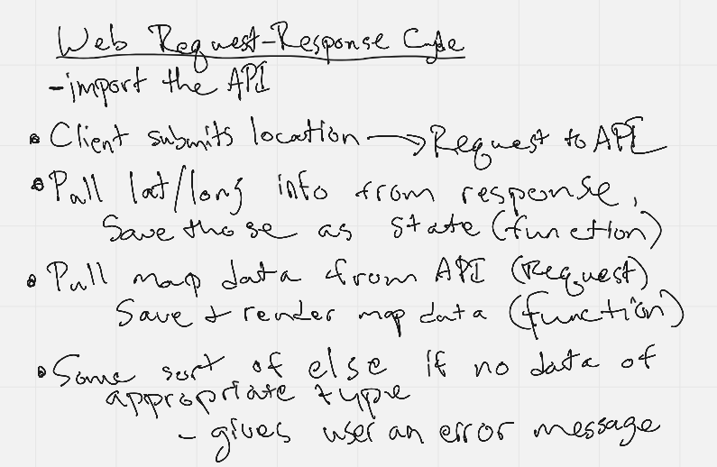
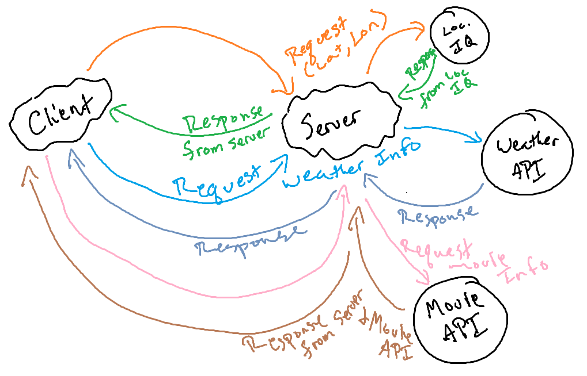

# City Explorer API

>**Author**: Justin Hamerly
>**Version**: 1.0.0 

## Overview

Server side for the City Explorer App

## Architecture

Technologies and tools: npm, node, cors, express, JavaScript

## Change Log

>*Version 1.0.0*
>
>- Connecting to the City Explorer App and rendering weather data from the weather data package.

## Credit and Collaborations

Classmates: Christopher Burk
W3 Schools
TA: Hexx King

>Name of feature: Connecting Server to front end and render weather data from the weather data file.
>
>Estimate of time needed to complete: 3.5 hours
>
>Start time: 2:30 pm
>
>Finish time: 9 PM
>
>Actual time needed to complete: 6.5 Hours

