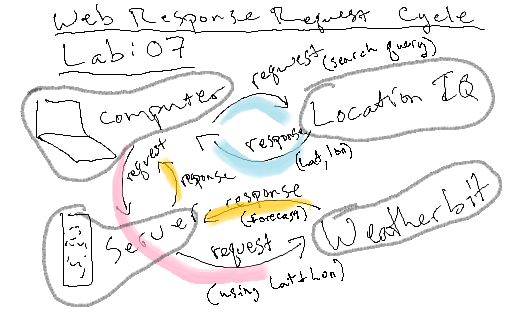

# city-explorer-api

**Author**: Justin Hamerly
**Version**: 1.0.0 

## Overview
<!-- Provide a high level overview of what this application is and why you are building it, beyond the fact that it's an assignment for this class. (i.e. What's your problem domain?) -->

## Getting Started
<!-- What are the steps that a user must take in order to build this app on their own machine and get it running? -->

## Architecture
Technologies and tools: npm, node, cors, express, JavaScript

## Change Log
Version 1.0.0: 

## Credit and Collaborations
Classmates: Christopher Burk
W3 Schools
TA: Hexx King

